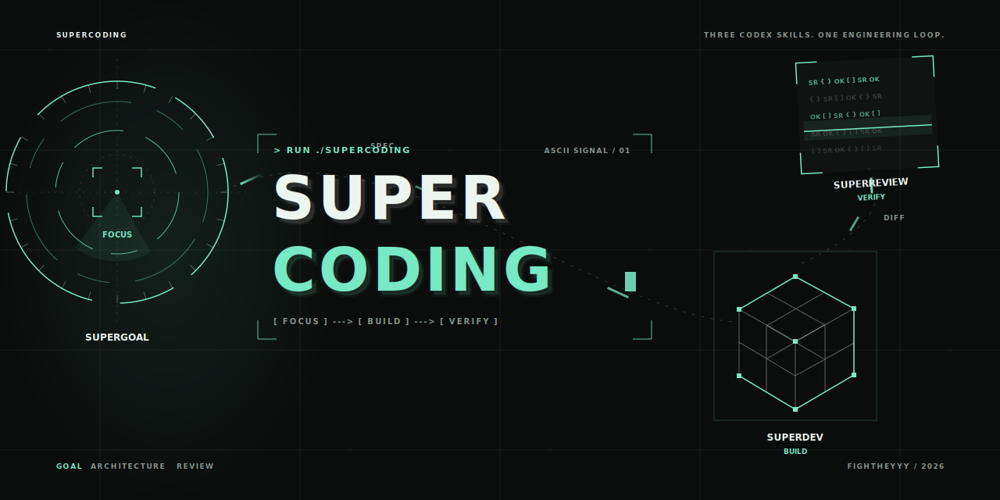
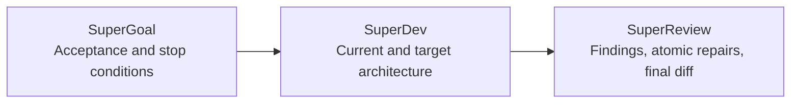

<div align="center">
  

  <h1>SuperCoding</h1>

  <p><strong>Focus the goal. Build the architecture. Verify the change.</strong></p>

  <p>Three installable Codex skills for goal orchestration, architecture-aligned AI coding, and evidence-backed code review.</p>

  <p>
    <a href="https://github.com/fightheyyy/SuperCoding/tree/main/skills/supergoal"></a>
    <a href="https://github.com/fightheyyy/SuperCoding/tree/main/skills/superdev"></a>
    <a href="https://github.com/fightheyyy/SuperCoding/tree/main/skills/superreview"></a>
    <a href="./LICENSE"></a>
  </p>

  <p>
    <a href="#quick-start">Quick start</a> ·
    <a href="#the-three-skills">The three skills</a> ·
    <a href="#use-them-together">Use them together</a> ·
    <a href="./README.zh-CN.md">中文</a>
  </p>
</div>

## One engineering loop

SuperCoding is not a grab bag of prompts. It is one continuous repository workflow: define observable success, keep implementation aligned with architecture, then review the effective change with evidence.



## The three skills

| Skill | Owns | Core invariant | Invoke it |
| --- | --- | --- | --- |
| [SuperGoal](./skills/supergoal/SKILL.md) | Acceptance-first goal orchestration, bounded subagent dispatch, stop conditions | The parent agent owns scope, integration, verification, and final acceptance | `Use $supergoal to execute this repository goal...` |
| [SuperDev](./skills/superdev/SKILL.md) | `SPEC.md` and `PLAN.md`, Current Architecture, Target Architecture, implementation alignment | Substantial implementation waits until the target Mermaid architecture is clear | `Use $superdev to implement this change...` |
| [SuperReview](./skills/superreview/SKILL.md) | Evidence-backed PR and diff review, confirmed findings, atomic repairs | The main reviewer owns every finding, patch decision, final check, and verdict | `Use $superreview to review and fix this PR...` |

## Quick start

### Install all three

```bash
git clone https://github.com/fightheyyy/SuperCoding.git
cd SuperCoding
./scripts/install.sh
```

The installer copies the three skills into `${CODEX_HOME:-$HOME/.codex}/skills` and registers SuperReview's repair agent in `${CODEX_HOME:-$HOME/.codex}/agents`.

If a destination already exists, the installer stops without changing it. Use `./scripts/install.sh --force` to move existing copies to timestamped backups before installing.

Restart Codex after installation so the new skills and repair agent are discovered.

### Install through the bundled Skill Installer

```bash
INSTALLER="${CODEX_HOME:-$HOME/.codex}/skills/.system/skill-installer/scripts/install-skill-from-github.py"

python3 "$INSTALLER" \
  --repo fightheyyy/SuperCoding \
  --path skills/supergoal skills/superdev skills/superreview
```

The generic Skill Installer does not register custom agents. Finish the SuperReview setup with:

```bash
mkdir -p "${CODEX_HOME:-$HOME/.codex}/agents"
cp \
  "${CODEX_HOME:-$HOME/.codex}/skills/superreview/agents/superreview-repair.toml" \
  "${CODEX_HOME:-$HOME/.codex}/agents/superreview-repair.toml"
```

## Use them together

Give Codex one outcome and make the ownership chain explicit:

```text
Use $supergoal to execute this repository change with observable stop conditions.
Apply $superdev before implementation so Current and Target Architecture stay aligned.
Before merge, use $superreview to review the effective diff and repair confirmed findings.
```

Or invoke each skill independently:

```text
Use $supergoal to turn this migration request into an acceptance-first goal and execute it.
Use $superdev to add this feature without drifting from the repository architecture.
Use $superreview to review and fix this pull request, then verify the final diff.
```

## How the loop works

### SuperGoal: focus

SuperGoal turns a broad repository request into acceptance criteria, explicit non-goals, stop conditions, and bounded child Goal Contracts. It is designed for long-running Codex goals, refactors, migrations, and multi-agent repository work.

### SuperDev: build

SuperDev keeps long-lived repositories honest about present reality and intended direction. It maintains root and module `SPEC.md` / `PLAN.md` files and requires Current Architecture and Target Architecture Mermaid diagrams before substantial implementation.

### SuperReview: verify

SuperReview establishes an exact PR, branch, commit, staged, or working-tree boundary. The main agent confirms actionable findings before delegating one atomic repair at a time, then personally rechecks every patch and the final effective diff.

## Repository layout

```text
SuperCoding/
├── skills/
│   ├── supergoal/
│   ├── superdev/
│   └── superreview/
├── docs/
│   ├── hero.svg
│   └── social-preview.png
├── scripts/
│   ├── install.sh
│   └── validate.sh
├── SPEC.md
├── PLAN.md
└── README.zh-CN.md
```

Each directory under `skills/` is an independent Codex skill package with its own trigger description and interface metadata.

## Compatibility and boundaries

- Built for Codex skill discovery and repository workflows.
- SuperReview repair mode also requires the bundled `superreview-repair` custom agent.
- Model and reasoning-level policies inside the skills apply only when the active Codex surface exposes those controls.
- The legacy SuperGoal macOS helper app is intentionally outside this repository.
- The three original repositories remain available as source history; this repository is the consolidated distribution surface.

## Source provenance

| Package | Source repository | Imported revision |
| --- | --- | --- |
| SuperGoal | [`fightheyyy/SuperGoal`](https://github.com/fightheyyy/SuperGoal) | `a4f857454e599fd2a07a76d79290ae428ea1dd70` |
| SuperDev | [`fightheyyy/SuperDev`](https://github.com/fightheyyy/SuperDev) | `e8d06d4d4dfaa28fa37f32a2e582969e6955d722` |
| SuperReview | [`fightheyyy/SuperReview`](https://github.com/fightheyyy/SuperReview) | `6208498076718ed9bd9d5425a979062f3bed1be4` |

## Validate

```bash
./scripts/validate.sh
```

The script checks required resources and metadata. When the official Skill Creator validator and PyYAML are available, it also validates all three skill packages with `quick_validate.py`.

Set `PYTHON_BIN=/path/to/python` when PyYAML is installed in a non-default Python environment.

## Contributing

Keep changes inside the skill that owns the behavior. Preserve each skill's relative resource paths, update root `SPEC.md` and `PLAN.md` when repository architecture changes, and run the validation script before opening a pull request.

## License

[MIT](./LICENSE) © 2026 fightheyyy
