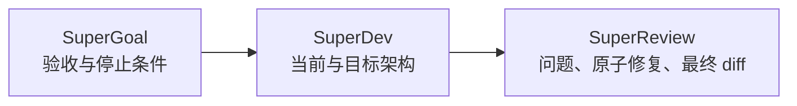

<div align="center">
  

  <h1>SuperCoding</h1>

  <p><strong>锁定目标，构建架构，验证改动。</strong></p>

  <p>三个可独立安装的 Codex Skill，覆盖目标编排、架构对齐开发和证据驱动的代码审查。</p>

  <p>
    <a href="#快速安装">快速安装</a> ·
    <a href="#三个-skill">三个 Skill</a> ·
    <a href="#组合使用">组合使用</a> ·
    <a href="./README.md">English</a>
  </p>
</div>

## 一条完整的工程回路

SuperCoding 不是三个提示词的简单合集。它把一次仓库工作串成连续回路：先定义可观察的成功，再让实现持续对齐架构，最后用证据审查真实改动。



## 三个 Skill

| Skill | 负责什么 | 核心不变量 | 调用方式 |
| --- | --- | --- | --- |
| [SuperGoal](./skills/supergoal/SKILL.md) | 验收优先的目标编排、有边界的子代理分派、停止条件 | 父代理拥有范围、集成、验证和最终验收 | `使用 $supergoal 执行这个仓库目标...` |
| [SuperDev](./skills/superdev/SKILL.md) | `SPEC.md`、`PLAN.md`、当前架构、目标架构和实现对齐 | 目标 Mermaid 架构清晰后才开始大规模实现 | `使用 $superdev 实现这个改动...` |
| [SuperReview](./skills/superreview/SKILL.md) | 基于证据的 PR/diff 审查、确认问题、原子修复 | 主审代理拥有问题判断、补丁取舍、最终检查和结论 | `使用 $superreview 审查并修复这个 PR...` |

## 快速安装

### 一次安装全部

```bash
git clone https://github.com/fightheyyy/SuperCoding.git
cd SuperCoding
./scripts/install.sh
```

安装脚本会把三个 Skill 复制到 `${CODEX_HOME:-$HOME/.codex}/skills`，并把 SuperReview 修复代理注册到 `${CODEX_HOME:-$HOME/.codex}/agents`。

如果目标目录已经存在，脚本会直接停止，不会覆盖文件。使用 `./scripts/install.sh --force` 时，旧版本会先移动到带时间戳的备份目录。

安装后重启 Codex，让新的 Skill 和修复代理进入发现列表。

### 使用 Codex 自带的 Skill Installer

```bash
INSTALLER="${CODEX_HOME:-$HOME/.codex}/skills/.system/skill-installer/scripts/install-skill-from-github.py"

python3 "$INSTALLER" \
  --repo fightheyyy/SuperCoding \
  --path skills/supergoal skills/superdev skills/superreview
```

通用 Skill Installer 不会注册自定义代理。SuperReview 还需要执行：

```bash
mkdir -p "${CODEX_HOME:-$HOME/.codex}/agents"
cp \
  "${CODEX_HOME:-$HOME/.codex}/skills/superreview/agents/superreview-repair.toml" \
  "${CODEX_HOME:-$HOME/.codex}/agents/superreview-repair.toml"
```

## 组合使用

可以把三个 Skill 写进同一个结果导向的请求：

```text
使用 $supergoal 执行这个仓库改动，并定义可观察的停止条件。
实现前应用 $superdev，让当前架构和目标架构保持对齐。
合并前使用 $superreview 审查真实 diff，并修复已经确认的问题。
```

也可以分别调用：

```text
使用 $supergoal 把这个迁移需求编译成验收优先的目标并执行。
使用 $superdev 在不偏离仓库架构的前提下实现这个功能。
使用 $superreview 审查并修复这个 PR，然后验证最终 diff。
```

## 工作方式

### SuperGoal：锁定

SuperGoal 把宽泛的仓库需求变成验收标准、非目标、停止条件和有边界的子 Goal Contract。它适合长时间运行的 Codex 目标、重构、迁移和多代理仓库工作。

### SuperDev：构建

SuperDev 要求长期仓库同时说明当前现实与目标方向。它维护根级和模块级 `SPEC.md` / `PLAN.md`，并在大规模实现前要求清晰的 Current Architecture 和 Target Architecture Mermaid 图。

### SuperReview：验证

SuperReview 先确定 PR、分支、提交区间、暂存区或工作树边界。主代理亲自确认有效问题，再逐项分派原子修复，最后亲自复核每个补丁和最终有效 diff。

## 仓库结构

```text
SuperCoding/
├── skills/
│   ├── supergoal/
│   ├── superdev/
│   └── superreview/
├── docs/
│   ├── hero.svg
│   └── social-preview.png
├── scripts/
│   ├── install.sh
│   └── validate.sh
└── README.md
```

`skills/` 下的每个目录都是独立的 Codex Skill 包，拥有自己的触发描述和界面元数据。

## 兼容性与边界

- 面向 Codex Skill 发现机制和仓库工作流。
- SuperReview 修复模式还依赖仓库内附带的 `superreview-repair` 自定义代理。
- 三套 Skill 的主会话一律沿用当前模型和推理档位，不设置模型门禁；只有委派的子代理或修复代理会在界面支持时使用独立模型配置。
- 旧 SuperGoal macOS 辅助应用不属于这个统一仓库。
- 三个原仓库继续保留源码历史；SuperCoding 是新的统一分发入口。

## 来源版本

| Skill | 来源仓库 | 导入版本 |
| --- | --- | --- |
| SuperGoal | [`fightheyyy/SuperGoal`](https://github.com/fightheyyy/SuperGoal) | `a4f857454e599fd2a07a76d79290ae428ea1dd70` |
| SuperDev | [`fightheyyy/SuperDev`](https://github.com/fightheyyy/SuperDev) | `e8d06d4d4dfaa28fa37f32a2e582969e6955d722` |
| SuperReview | [`fightheyyy/SuperReview`](https://github.com/fightheyyy/SuperReview) | `6208498076718ed9bd9d5425a979062f3bed1be4` |

## 验证

```bash
./scripts/validate.sh
```

脚本会检查必需资源和元数据。如果本机存在官方 Skill Creator 校验器和 PyYAML，还会通过 `quick_validate.py` 验证三个 Skill。

如果 PyYAML 安装在非默认 Python 环境，可通过 `PYTHON_BIN=/path/to/python` 指定解释器。

## License

[MIT](./LICENSE) © 2026 fightheyyy
