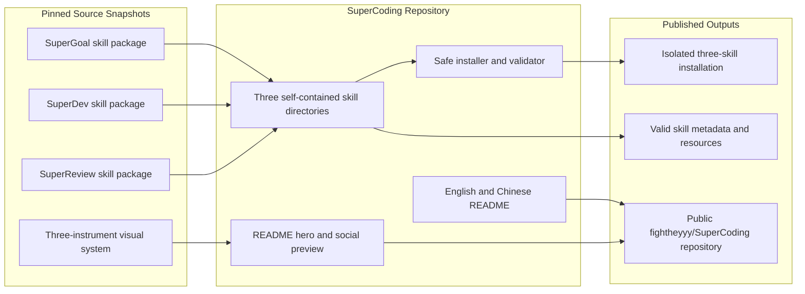
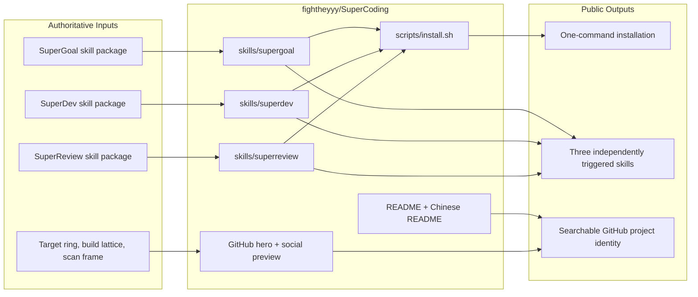

# SuperCoding Specification

SuperCoding packages SuperGoal, SuperDev, and SuperReview as one installable repository and one coherent public identity.

## Scope

- In scope: three independently installable Codex skills, their required resources and agent metadata, a shared GitHub README, a deterministic installer, a README hero, a social-preview asset, and source provenance.
- Out of scope: the SuperGoal macOS app, rewriting the three skills during consolidation, deleting or archiving the source repositories, and preserving every upstream Git commit inside the new repository.

## Repository Contract

- `skills/supergoal`, `skills/superdev`, and `skills/superreview` remain self-contained skill packages.
- Each skill keeps its own `agents/openai.yaml`; metadata is not flattened into the repository root.
- SuperGoal keeps `references/goal-contract-template.md` at its existing relative path.
- SuperReview keeps both icon files and `agents/superreview-repair.toml` at their existing relative paths.
- The root installer installs all three skill directories and registers the SuperReview repair agent.
- The root README is English for GitHub discoverability; `README.zh-CN.md` provides the Chinese version.

## Current Architecture

## Target Architecture

## Source Provenance

- SuperGoal: `fightheyyy/SuperGoal`, commit `a4f857454e599fd2a07a76d79290ae428ea1dd70`, path `skills/supergoal`.
- SuperDev: `fightheyyy/SuperDev`, commit `e8d06d4d4dfaa28fa37f32a2e582969e6955d722`.
- SuperReview: `fightheyyy/SuperReview`, commit `6208498076718ed9bd9d5425a979062f3bed1be4`.

## Validation Contract

- All three skill folders pass the Skill Creator `quick_validate.py` validator.
- YAML and TOML metadata parse successfully.
- All relative references and icon paths resolve.
- The installer succeeds into an isolated temporary `CODEX_HOME` without modifying the user's active installation.
- The README hero remains legible at 1280 x 640 and at a 640 x 320 preview size.
- GitHub repository description and topics match the actual supported scope.
